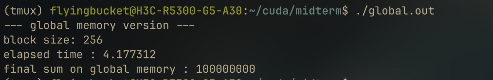
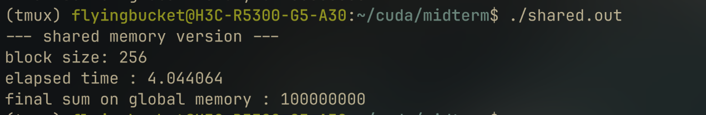
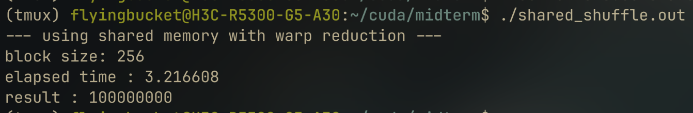

# 中期作业报告

在这个规约求和的实现中，首先将输入数组按block求和，返回每个block的规约求和结果构成的数组，然后在cpu端使用cpp的numeric库进行最终的求和。整个过程将使用cuda事件来测量时间。

相关的核函数及其声明写在kernels.cu和kernels.cuh中。

## 第一版规约求和

这个版本中，设备端求和完全使用全局内存。下面是运行截图和ncu分析结果。

考虑使用共享内存来进行初步优化，使用shuffle指令来进一步加速block内的规约求和。

## 第二版规约求和
在第二版中，使用共享内存来进行block内的规约求和。每个block的线程将数据加载到共享内存中，但暂不使用shuffle指令。下面是运行截图和ncu分析结果。

## 第三版规约求和
在第三版中，使用了shuffle指令来进一步加速block内的规约求和。每个block的线程将数据加载到共享内存中，并使用shuffle指令进行规约求和。下面是运行截图和ncu分析结果。

## 总结
通过这三个版本的实现，我们可以看到使用共享内存和shuffle指令对规约求和的性能有显著提升。每一版相较上一版在运行时间上都有大约10%到25%的提升。